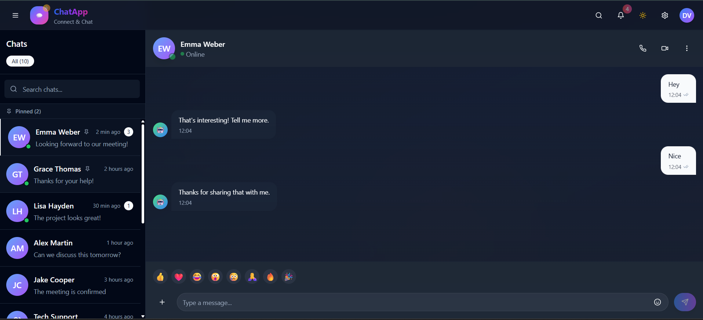
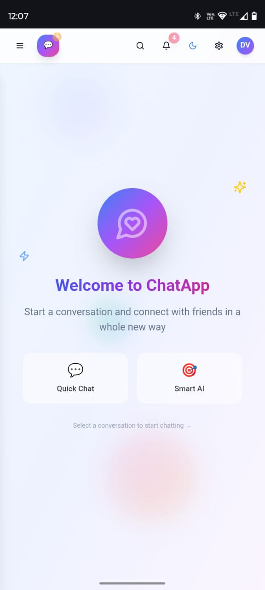

# 💬 ChatApp - Frontend Assignment

A modern, responsive chat interface built with **Next.js** and **Tailwind CSS**, designed as part of a frontend assignment. This app mimics the look and feel of popular messaging apps like WhatsApp and Messenger, with real-time-like UX behaviours and clean UI design.

---

## 🚀 Live Demo

👉 [Open Production Link](https://frontend-chat-application.netlify.app/)

---

## ✨ Features Implemented

- ✅ Responsive layout for both desktop and mobile views  
- ✅ Sidebar with:
  - Contact list
  - Search functionality
  - Smooth collapse animation
- ✅ Chat wall with:
  - User and bot messages
  - Typing animation after the message is sent
  - Reply-to-message feature
- ✅ Message status tracking:
  - Sent → Delivered → Read (simulated)
- ✅ Custom scrollbar + mobile-first design polish
- ✅ Dynamic avatars (initials or icon-based)

---

## 🛠️ Tech Stack

- **Next.js** (App Router)
- **TypeScript**
- **Tailwind CSS**
- **Lucide Icons**
- **Netlify** for deployment

---

## 📸 Screenshots

| Desktop View | Mobile View |
|--------------|-------------|
|  |  |

---

